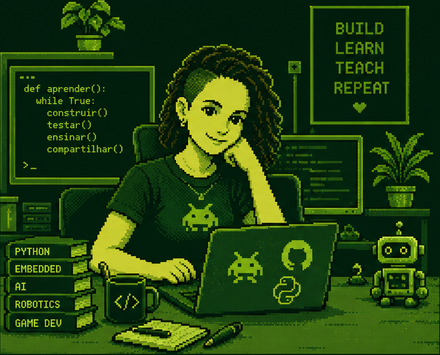
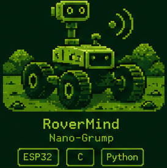
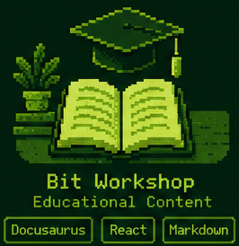
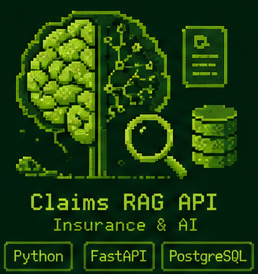
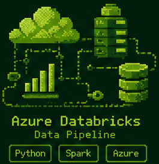
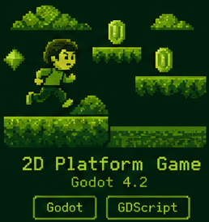
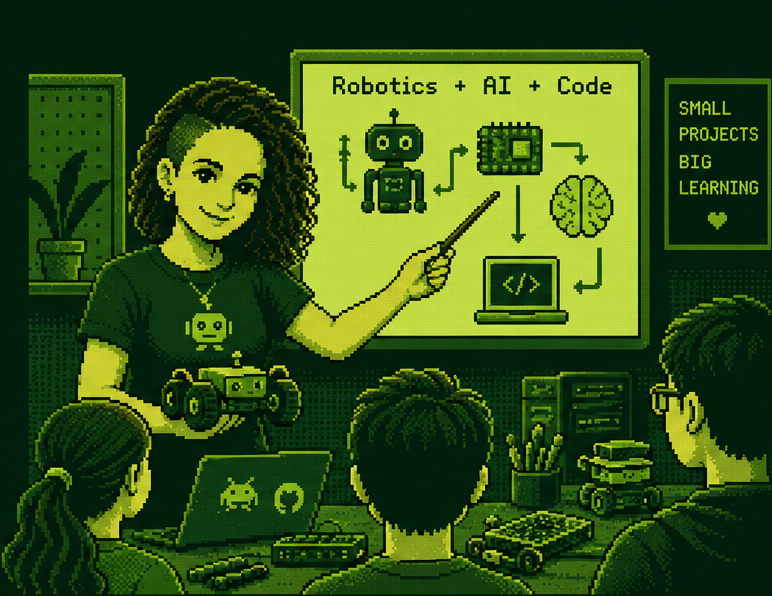

<table>
  <tr>
    <td>
      <pre>
██╗     ██╗   ██╗ █████╗ ███╗   ██╗ █████╗
██║     ██║   ██║██╔══██╗████╗  ██║██╔══██╗
██║     ██║   ██║███████║██╔██╗ ██║███████║
██║     ██║   ██║██╔══██║██║╚██╗██║██╔══██║
███████╗╚██████╔╝██║  ██║██║ ╚████║██║  ██║
╚══════╝ ╚═════╝ ╚═╝  ╚═╝╚═╝  ╚═══╝╚═╝  ╚═╝  
██████╗ ██╗   ██╗███████╗ ██████╗ █████╗ ██████╗ ██╗ ██████╗ ██╗      ██████╗
██╔══██╗██║   ██║██╔════╝██╔════╝██╔══██╗██╔══██╗██║██╔═══██╗██║     ██╔═══██╗
██████╔╝██║   ██║███████╗██║     ███████║██████╔╝██║██║   ██║██║     ██║   ██║
██╔══██╗██║   ██║╚════██║██║     ██╔══██║██╔══██╗██║██║   ██║██║     ██║   ██║
██████╔╝╚██████╔╝███████║╚██████╗██║  ██║██║  ██║██║╚██████╔╝███████╗╚██████╔╝
╚═════╝  ╚═════╝ ╚══════╝ ╚═════╝╚═╝  ╚═╝╚═╝  ╚═╝╚═╝ ╚═════╝ ╚══════╝ ╚═════╝
      </pre>
    </td>
    <td>
      
    </td>
  </tr>
</table>

```
┌──────────────────────────────────────────────────────────────┐
│  SYSTEM BOOT ................................ OK             │
│  ENGENHEIRA  ─ por conhecimento                              │
│  PROFESSORA  ─ por vocação                                   │
│  MODO ATUAL  ─ robótica + programação para ensino            │
│                                                              │
│  LEVEL ....... SEMPRE A APRENDER                             │
│  XP .......... ████████████████████░░░░░░░  [ ∞ ]            │
└──────────────────────────────────────────────────────────────┘
```

<p align="center">
  <a href="https://linkedin.com/in/luana-buscariolo"></a>
  <a href="https://github.com/luanabuscariolo"></a>
  <a href="https://luanabuscariolo.github.io/bit-workshop/"></a>
  <a href="https://www.youtube.com/@luanabuscariolo"></a>
  <a href="https://instagram.com/lu_buscariolo"></a>
  <a href="mailto:luanabuscariolo@gmail.com"></a>
</p>

---

```
> whoami
```

Sou engenheira de formação e professora por vocação — e as duas coisas puxam
para o mesmo sítio: perceber como algo funciona por dentro e depois explicá-lo
de forma que outra pessoa consiga construir sozinha.

```
> cat filosofia.txt

  "Projetos pequenos, aprendizagem grande."
  Construir → Testar → Ensinar → Partilhar → repetir.
```

---

```
> tree ~/skills
```

```
CURIOUS MIND
│
├── ROBÓTICA & EMBEDDED ............ [ foco atual ]
│   ├── ESP32 · microcontroladores
│   ├── Embedded C · sensores & atuadores
│   └── Edge AI · visão computacional em dispositivo
│
├── ENGENHARIA DE SOFTWARE
│   ├── Python · Java / Spring · C# .NET
│   ├── APIs REST · FastAPI
│   └── GDScript · Godot
│
├── DADOS & IA
│   ├── SQL · PostgreSQL · modelação de dados
│   ├── PySpark · Databricks · Azure
│   └── RAG · LLMs · Machine Learning
│
└── EDUCAÇÃO & CRIAÇÃO ............. [ vocação ]
    ├── Workshops e formação prática
    ├── Documentação e conteúdo técnico
    └── Game dev como ferramenta pedagógica
```

<p align="center">
  
  
  
  
  
  
  <br>
  
  
  
  
  
  <br>
  
  
  
  
  
  
</p>

---

```
> ls ~/projects --featured
```

<table>
  <tr>
    <td align="center" width="20%">
      <a href="https://github.com/luanabuscariolo/RoverMind-nanoGrump">
        <br>
        <b>RoverMind · nanoGrump</b>
      </a><br>
      <sub>Rover autónomo com Edge AI<br>a correr em ESP32.</sub><br><br>
      <sub><code>ESP32</code> <code>C</code> <code>Python</code></sub>
    </td>
    <td align="center" width="20%">
      <a href="https://luanabuscariolo.github.io/bitvolts-lab/">
        <br>
        <b>BitVolts Lab</b>
      </a><br>
      <sub>Conteúdo educativo sobre robótica,<br>IA e programação.</sub><br><br>
      <sub><code>Docusaurus</code> <code>React</code> <code>Markdown</code></sub>
    </td>
    <td align="center" width="20%">
      <a href="https://github.com/luanabuscariolo/claims_rag_api">
        <br>
        <b>Claims RAG API</b>
      </a><br>
      <sub>Sistema RAG para perguntas<br>sobre sinistros de seguros.</sub><br><br>
      <sub><code>Python</code> <code>FastAPI</code> <code>PostgreSQL</code></sub>
    </td>
    <td align="center" width="20%">
      <a href="https://github.com/luanabuscariolo/pipeline-azure-databricks">
        <br>
        <b>Pipeline Azure Databricks</b>
      </a><br>
      <sub>Pipeline de engenharia de dados<br>na cloud.</sub><br><br>
      <sub><code>Python</code> <code>Spark</code> <code>Azure</code></sub>
    </td>
    <td align="center" width="20%">
      <a href="https://github.com/luanabuscariolo/your-first-2D-Platform-Game-with-Godot-4.2">
        <br>
        <b>2D Platform Game</b>
      </a><br>
      <sub>Tutorial de jogo de plataformas<br>para quem começa do zero.</sub><br><br>
      <sub><code>Godot 4.2</code> <code>GDScript</code></sub>
    </td>
  </tr>
</table>

```
> ls ~/projects --all
```

| Repositório | O que é | Stack |
|---|---|---|
| [`insurance_data_engineering_project`](https://github.com/luanabuscariolo/insurance_data_engineering_project) | Projeto de engenharia de dados sobre um domínio de seguros, do modelo relacional às consultas analíticas. | `Python` `SQL` `PostgreSQL` |
| [`banking-api-spring`](https://github.com/luanabuscariolo/banking-api-spring) | API REST bancária com camadas de serviço, persistência e testes. | `Java` `Spring Boot` |
| [`educational-management-platform`](https://github.com/luanabuscariolo/educational-management-platform) | Plataforma de gestão educativa (back-end + front-end), projeto final de bootcamp em equipa. | `Full-stack` |
| [`FacialExpressionDetectionWithPython`](https://github.com/luanabuscariolo/FacialExpressionDetectionWithPython) | Deteção de expressões faciais com visão computacional. | `Python` `OpenCV` |
| [`projectManager`](https://github.com/luanabuscariolo/projectManager) | Gestor de projetos e tarefas — exercício de arquitetura e organização de código. | `Backend` |

---

```
> teacher --mode=on
```

<table>
  <tr>
    <td>
      <pre>
        ┌─ ENSINAR ────────────┬─ INSPIRAR ───────────┐
        │ Partilhar o que sei  │ Mostrar que é        │
        │ é o que fixa o que   │ possível construir   │
        │ aprendi.             │ com pouco.           │
        ├─ CONSTRUIR ──────────┼─ APRENDER ───────────┤
        │ Projetos com as mãos │ Todos os dias,       │
        │ e com propósito.     │ com intenção.        │
        └──────────────────────┴──────────────────────┘
      </pre>
    </td>
    <td>
      <p align="center">
        
      </p>
    </td>
  </tr>
</table>

O **[BitVolts Lab](https://luanabuscariolo.github.io/bitvolts-lab/)** é onde
junto tudo isto: materiais abertos de robótica, IA e programação, escritos para
quem nunca tocou numa placa e quer sair da sessão com algo a funcionar.

---

```
> exit

  ╔═══════════════════════════════════════════════════════╗
  ║  C O D E  ·  B U I L D  ·  T E A C H  ·  R E P E A T  ║
  ╚═══════════════════════════════════════════════════════╝

  Connection closed. Obrigada pela visita. ♥
```
